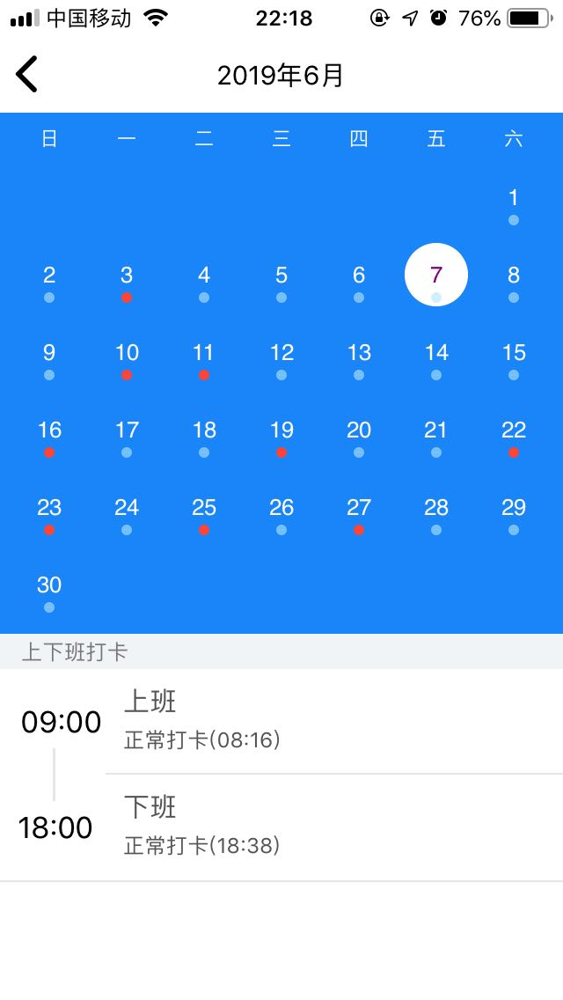
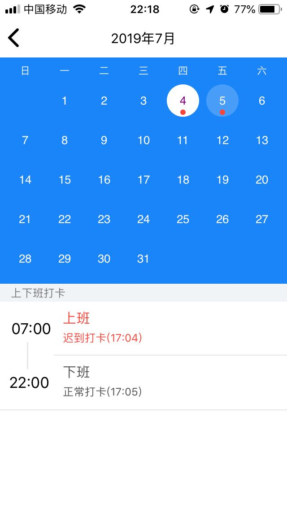

# ZarkCalendar
  iOS 仿企业微信打卡、打卡记录。 可当做一个通用的日历来用。
  
  
  
              效果1
  
  ------------------------------------------------------
  
  
  
              效果2
  
  PMMonthView  日历控件
  PMClockinRecordsFooterView 打卡信息控件
  

  PMClockInViewController 打卡操作页面
  
  PMClockinRecordsViewController  打卡记录页面
  PMClockinRecordsViewController 包含一个scrollView，和PMClockinRecordsFooterView
  scrollView包含3个日历空件，‘循环滚动’。
  PMClockinRecordsFooterView  展示打卡信息
  
  
